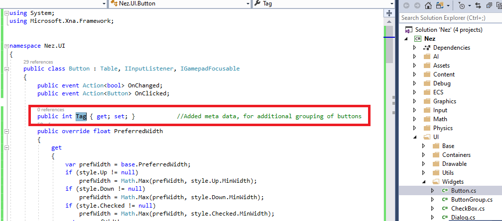
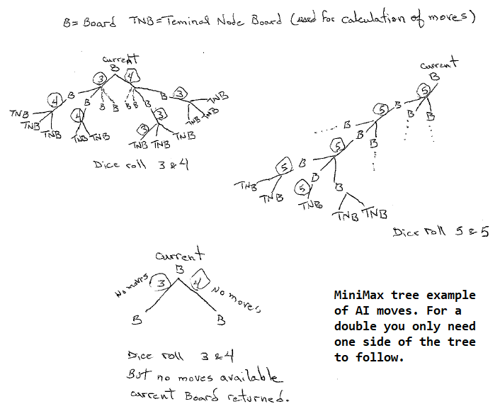

# Nez ECS Backgammon Example

This is a Backgammon game Human vs. Computer. Comuter uses minimax (with Huristic values) to determine its move.  I am Using NEZ 2D which is a fantastic 2D Framework specifically using C# and Monogame.

https://github.com/prime31/Nez

Entity Component System (ECS) is used to allow for separation of concern when coding. For example, I choose to update my components using a separate "System".  
However, You will find most examples of NEZ to be using updates inside "Components".  I don't like that.  NEZ is flexible enough to allow you to choose which way to go !!

## Main Screen

I've added a "Tag" property to all Buttons in Nez.  Please make that addition to your Nez project, recompile.  See the image below.

## AI move tree

